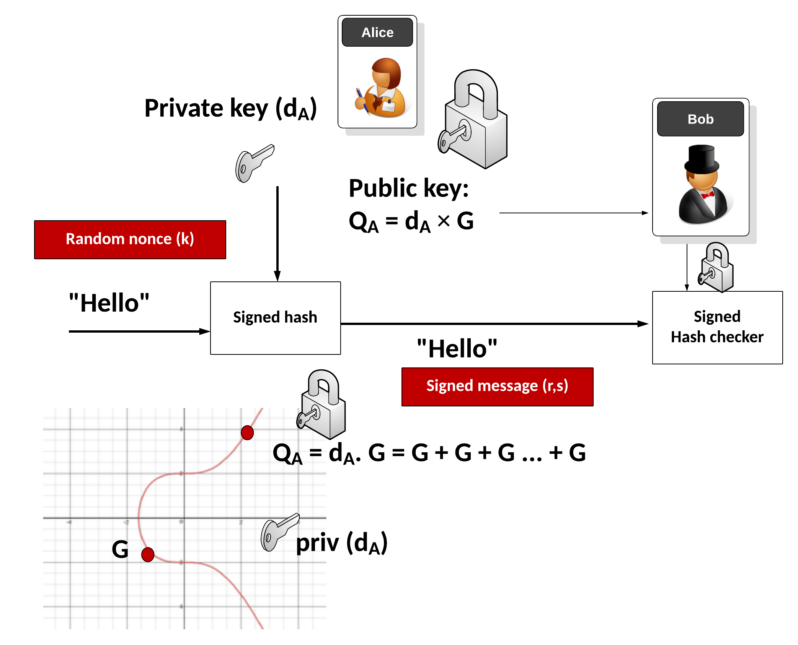

# Elliptic Curve Digital Signature Algorithm (ECDSA)

The **Elliptic Curve Digital Signature Algorithm (ECDSA)** is based on **Elliptic Curve Cryptography (ECC)** and is used to generate keys, authenticate, sign, and verify messages. In Ethereum, ECDSA signatures are fundamental for proving ownership and authorizing transactions.

---

## ECDSA Signatures Explained

### Authentication in Ethereum
Ethereum uses **public/private key pairs** for proof of ownership:
- **Private key**: signs messages and derives the public key.
- **Public key**: verifies the private key.
- **Ethereum address**: last 20 bytes of the hash of the public key.

This ensures that only the account owner can authorize actions without revealing their private key.

---

## What is a Signature?

A **signature** acts as a unique fingerprint for a transaction:
- Proves the message was signed by the account owner.
- Generated by **hashing the message** and combining it with the private key using ECDSA.
- Each signature is **unique** due to the inclusion of a **nonce** to prevent replay attacks.

---

## The secp256k1 Elliptic Curve

Ethereum (like Bitcoin) uses the **secp256k1** elliptic curve:
- Symmetrical about the x-axis.
- Generator point **G** (a specific fixed point).
- Order **n**: defines the length of private keys (256 bits).
- Chosen for **security, efficiency, and compatibility**.

⚠️ Vulnerability:  
Two valid signatures can exist for the same signer → **signature malleability**, which can lead to replay attacks.

---

## Ethereum ECDSA Signature Format

Ethereum signatures contain **three integers** `(r, s, v)`:

- **r**: x-coordinate from a random point `R = k * G`.
- **s**: proof that the signer knows the private key (depends on `k` and the private key).
- **v**: recovery identifier to specify which solution for R is correct.

---

## 1. ECDSA Key Generation

- **Private key (p)**: random integer in `[1 … n-1]`.
- **Public key (Q)**: calculated as `Q = p * G`.

### Security: The Elliptic Curve Discrete Logarithm Problem (ECDLP)
Given `Q = p * G`, it’s computationally infeasible to find `p` from `Q`:
- Equivalent to factoring very large numbers.
- Secure against classical computers.
- ⚠️ **Quantum computing** may threaten this security in the future.

---

## 2. ECDSA Signing (Signature Creation)

Steps:
1. Hash the message:  
   `h = hash(msg)`
2. Generate random nonce `k`.
3. Compute point `R = k * G`, then take `r = R.x`.
4. Compute signature proof:  
   `s = k^-1 * (h + p * r) mod n`
5. Signature = **(r, s)**

---

## 3. ECDSA Signature Verification

Given `(msg, signature, pubKey)`:
1. Hash the message: `h = hash(msg)`.
2. Compute modular inverse:  
   `s1 = s^-1 mod n`
3. Recreate the random point:  
   `R' = (h * s1) * G + (r * s1) * pubKey`
4. Compare `r' = R'.x` with `r`.
   - If equal → **valid signature**.

Ethereum uses the **`ecrecover` precompile** to:
- Verify signatures.
- Retrieve the signer’s address from `(msg, signature)`.

---

## Summary

- **ECDSA** underpins Ethereum account security.
- Uses **secp256k1 curve** for efficiency and compatibility.
- Relies on the **ECDLP problem** for cryptographic strength.
- Provides:
  - **Key generation** (private/public pairs).
  - **Message signing** (producing `(r, s, v)`).
  - **Signature verification** (`ecrecover`).
- Essential for **authentication, transaction authorization, and smart contract security**.

---
